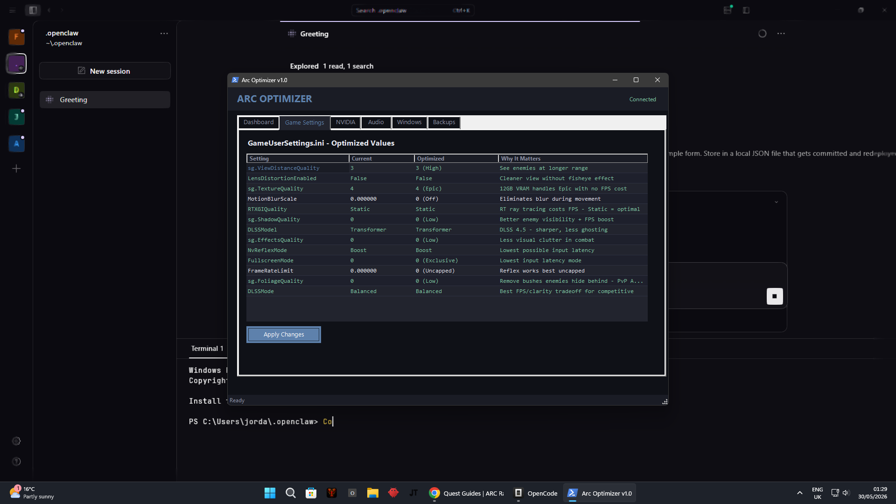

# Arc Optimizer 🎮⚡

**One-click competitive optimization tool for Arc Raiders (The Finals engine).**

Arc Optimizer detects your system, reads your game config, and applies proven competitive settings with a single click. Native Windows GUI — no dependencies, no browser, no web server.



## Features

- **One-click optimization** — Backs up your config, patches 20+ settings (DLSS Balanced, Reflex Boost, Foliage Low for PvP, uncapped FPS, exclusive fullscreen), creates Engine.ini with UE5 visual clutter disabled, sets files to read-only
- **Live system dashboard** — GPU name, driver version, VRAM, NVIDIA Reflex status, power plan, audio devices — all detected automatically
- **Game Settings viewer** — Color-coded table comparing current vs optimized values with explanations
- **NVIDIA recommendations** — Low Latency Ultra, Power Max Performance, Shader Cache Unlimited, DLSS Override guide
- **Audio recommendations** — Windows Sonic spatial sound, SupremeFX driver detection, 24-bit 48kHz format
- **Windows recommendations** — Game Mode, HAGS, fullscreen optimizations
- **Backup manager** — Every optimization creates a timestamped backup; view and restore from the Backups tab
- **Dark theme** — Professional dark UI with Nord accent (#5E81AC), designed for gaming setups

## Requirements

| Requirement | Notes |
|---|---|
| **OS** | Windows 10/11 |
| **GPU** | NVIDIA (uses `nvidia-smi` for detection) |
| **Game** | Arc Raiders (Steam), launched at least once |
| **PowerShell** | 5.1+ (built into Windows) |

No additional software required. No Python, no Node.js, no web server.

## Usage

1. **Download** the latest release from [Releases](https://github.com/jordan-thirkle/arc-optimizer/releases)
2. **Extract** the zip to any folder
3. **Double-click** `Arc-Optimizer.cmd`
4. **Click** "OPTIMIZE EVERYTHING"

The app auto-detects your GPU, game install, and config file. All changes are backed up automatically.

## What It Changes

### GameUserSettings.ini

| Setting | Optimized Value | Why |
|---|---|---|
| `sg.ViewDistanceQuality` | 3 (High) | See enemies at range |
| `sg.ShadowQuality` | 0 (Low) | Better visibility + FPS |
| `sg.FoliageQuality` | 0 (Low) | See through bushes — PvP advantage |
| `sg.TextureQuality` | 4 (Epic) | 12GB VRAM handles it |
| `DLSSMode` | Balanced | Best FPS/clarity tradeoff |
| `DLSSModel` | Transformer | DLSS 4.5 — sharper, less ghosting |
| `NvReflexMode` | Boost | Lowest input latency |
| `FrameRateLimit` | 0 (Uncapped) | Reflex works best uncapped |
| `FullscreenMode` | 0 (Exclusive) | Lowest input latency |
| `MotionBlurScale` | 0 | No blur during movement |
| `RTXGIQuality` | Static | RT ray tracing = FPS killer |

### Engine.ini (created)

- Motion Blur disabled
- Depth of Field disabled
- Bloom/Lens Flare disabled
- Volumetric Fog disabled
- Ambient Occlusion disabled
- Screen Space Reflections disabled
- Sharpen +0.5 applied
- Texture streaming optimized for 12GB VRAM (4096MB pool)

### Manual Steps (shown in app)

- NVIDIA App — DLSS Override → Model Presets: Recommended
- Windows — Enable HAGS, Game Mode, Windows Sonic
- File Explorer — Disable fullscreen optimizations on `start_protected_game.exe`

## Building from Source

```powershell
# Just run it directly — no build step needed
powershell -NoProfile -ExecutionPolicy Bypass -File Arc-Optimizer.ps1
```

The entire app is a single PowerShell script using .NET WinForms. Edit `Arc-Optimizer.ps1` to customize settings.

## Why PowerShell WinForms?

- **Zero dependencies** — Runs on every Windows 10/11 machine
- **Native GUI** — Real Windows Forms, not a web page in a browser
- **No runtime** — No Python, Node.js, or .NET SDK required (uses built-in .NET Framework)
- **Single file** — The whole app is one `.ps1` script

## Acknowledgments

- [JagsFPS](https://youtube.com/@jagsfps) — Arc Raiders optimization research
- [r/OptimizedGaming](https://reddit.com/r/OptimizedGaming) — Per-setting breakdowns
- [PCGamingWiki](https://pcgamingwiki.com) — Config locations and engine tweaks
- NVIDIA — DLSS 4.5 / Reflex documentation

## License

MIT — do whatever you want with it.
